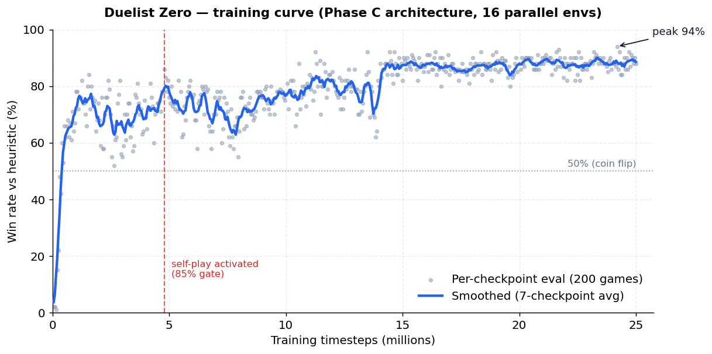
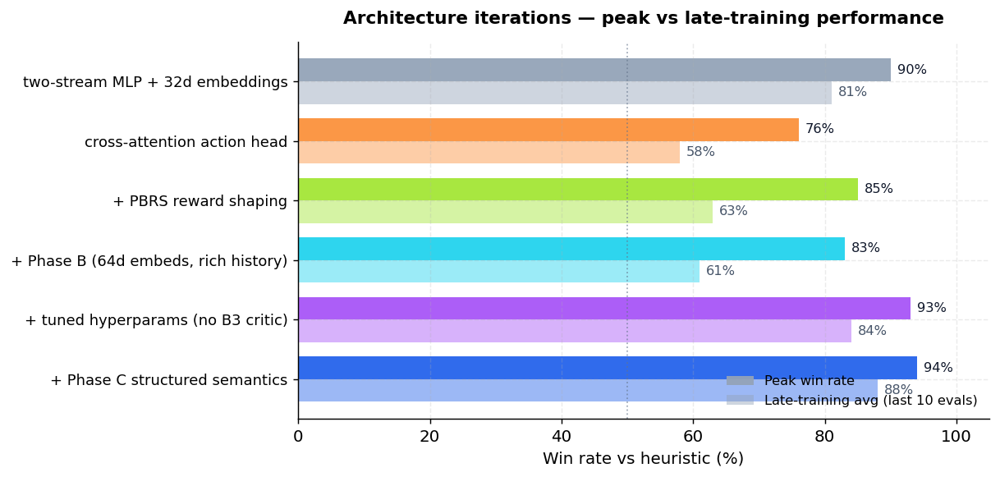

# Duelist Zero

**A from-scratch reinforcement-learning agent that plays Yu-Gi-Oh! (GOAT format) by interfacing directly with the official C++ engine.**

Built end-to-end: Python ctypes bindings to a 50k-line C++/Lua game engine, a custom Gymnasium environment with action masking and a transformer-based feature extractor, a custom RL algorithm that merges `sb3-contrib`'s `RecurrentPPO` and `MaskablePPO` (the combination doesn't exist upstream), and a self-play training pipeline that reaches **88% win rate (94% peak)** against a strong heuristic opponent.



---

## Highlights

| | |
|---|---|
| **Final win rate** | 88% vs heuristic (94% peak), measured over 200-game evaluations |
| **Training scale** | 25M timesteps, 16 parallel envs (`SubprocVecEnv`), ~12 days on a single GPU |
| **Engine** | Direct ctypes bindings to [`ygopro-core`](https://github.com/Fluorohydride/ygopro-core) — no fork, no patches to the C++ source |
| **Algorithm** | `MaskableRecurrentPPO` — custom merge of `sb3-contrib`'s LSTM-PPO + Maskable-PPO (1,130 LOC) |
| **Network** | 3-segment TransformerEncoder over board/action/history tokens, cross-attention action head, LLM-pretrained card embeddings |
| **Hot-path speedup** | 14.7× observation encoding via a Cython rewrite |

## How it works

```
┌──────────────────────────────────────────────────────────────────────┐
│                          libocgcore.so                               │
│              (C++/Lua game engine — rules + 14k cards)               │
└────────────────────────────┬─────────────────────────────────────────┘
            ctypes bindings  │  callbacks (read card / get response)
┌────────────────────────────▼─────────────────────────────────────────┐
│  Duel lifecycle  ◄──────►  GameState  ◄──────►  MessageParser        │
│  (engine ticks)            (Python truth)       (40+ MSG_* types)    │
└────────────────────────────┬─────────────────────────────────────────┘
                             │
┌────────────────────────────▼─────────────────────────────────────────┐
│                     GoatEnv (gymnasium.Env)                          │
│  ──────────────────────────────────────────────────────────────────  │
│   observation:                       action_space:                   │
│     features        (462,)            71 discrete                    │
│     card_ids        (50,)             + action mask                  │
│     action_features (71, 29)            (only legal moves)           │
│     action_history  (16, 13)                                         │
└────────────────────────────┬─────────────────────────────────────────┘
                             │
┌────────────────────────────▼─────────────────────────────────────────┐
│              CardEmbeddingExtractor (PyTorch)                        │
│                                                                      │
│   board (50)   ─┐                                                    │
│   action (71)  ─┼─► TransformerEncoder ─► segment-mean pool          │
│   history (16) ─┘    (d=64, h=4, L=2)     (3 × 64 = 192)             │
│                                              │ Linear → 256          │
│                                              ▼                       │
│   [features(462) | embed(256)] ─► MLP ─► LSTM(256) ─┐                │
│                                                     │                │
│                              ┌──────────────────────┼───┐            │
│                              ▼                          ▼            │
│              CrossAttentionActionHead          Value Head            │
│              (scores each action with its       Linear(512, 1)       │
│              transformer token + LSTM state)                         │
└──────────────────────────────────────────────────────────────────────┘
```

**Why these pieces?**

- **Action masking** is non-negotiable in Yu-Gi-Oh — at any moment only a handful of the 71 actions are legal. Vanilla PPO would have to learn legality from reward signal alone, wasting most of the action distribution.
- **LSTM memory** lets the agent track temporal state within a game (chains-in-progress, what was set on a previous turn) without serialising it all into the observation.
- **Cross-attention action head** scores each action conditioned on its own per-action transformer token (card stats, effect categories, ATK matchup) rather than mapping a fixed logit slot to a semantic action — that fixed-slot bottleneck capped the previous architecture at ~80%.
- **LLM-pretrained embeddings** initialise the 14,337-card vocabulary from sentence-transformer encodings of each card's effect text (PCA to 64d, 64% variance retained), then fine-tune during training. Cards with similar effects start near each other in embedding space instead of random points.

## Results



Each iteration targeted a specific bottleneck identified empirically. *Peak* is the best single 200-game eval; *late-training avg* is the mean of the final ten 200-game evals.

| Iteration | Key change | Peak | Late avg | Why it matters |
|---|---|---:|---:|---|
| v1 | Three-segment Transformer + 32d embeddings | 90% | 81% | Established baseline. Agent learned to *exploit* the heuristic but not to *understand cards* — visible in qualitative human-play tests (would MST its own backrow, attack into stronger monsters). |
| v2 | Cross-attention action head | 76% | 58% | New action head plus a too-low 70% self-play gate; agent's policy *eroded* against its own past checkpoints. Diagnosed and fixed in v3+. |
| v3 | Potential-based reward shaping (PBRS, Ng 1999) | 85% | 63% | Dense intermediate signal from `Φ(s) = 0.4·atk_adv + 0.25·card_adv + 0.35·lp_adv`, theoretically guaranteed not to change the optimal policy. |
| v4 | Phase B: 64d embeddings, richer action history, opponent inference, board-attention value head | 83% | 61% | Critic regression — the attention-based value head was too hard to optimise alongside the existing actor. Explained variance *declined* through training. |
| v5 | Disabled the bad critic + tuned hyperparams for the larger model | 93% | 84% | Recovered. `batch_size 128→256`, `epochs 2→4`, `ent_coef 0.10→0.05`, `vf_coef 0.5→0.8`. |
| v6 | Phase C: structured card semantics — per-target ownership flags, 12 effect-category flags, ATK matchup features for attack actions | 94% | 88% | Fixed the v1 qualitative failures. The action head can now read "this target is mine" and "this card destroys spell/traps" directly. |

## Engineering challenges worth highlighting

A short tour of the kind of issues this project surfaced. Full incident log in [`docs/technical-summary.md`](docs/technical-summary.md).

- **`CardData` struct setcode mismatch (16-byte ABI drift).** Python ctypes declared `setcode` as `c_uint32 × 4` (16 bytes); the C struct uses `uint16_t[16]` (32 bytes). Every field after `setcode` was shifted; the engine reported `type=0` for every card, so the action space never offered "summon." The agent trained for hundreds of thousands of steps seeing only "pass / set spell-trap / end turn." Fix: one line, but invisible without diffing against the C header.
- **`DUEL_1_FACEUP_FIELD = 0x20` was actually `DUEL_TAG_MODE`.** Python constants for engine flags were copy-pasted from an outdated source. Setting `0x20` accidentally enabled Tag-Duel mode; on turn 2 the engine swapped the opponent's deck with an empty tag deck, causing instant deck-out. The agent achieved 100% win rate "by ending its turn" — a perfect Goodhart's-law scenario that took a full session to root-cause.
- **Battle-command categories silently swapped.** ygopro's `playerop.cpp` defines battle category 0 = activate, 1 = attack. The Python code had them reversed. Every attack was decoded as "activate effect" — the agent looked like it never attacked. The bug was invisible without reading `playerop.cpp` line-by-line.
- **Self-play co-adaptation collapse.** When self-play activated, both copies converged on a passive, defensive policy and the heuristic win rate crashed. Fixed by (1) a frozen-pool opponent (no live-self), (2) a 60% heuristic / 20% recent / 20% older mix instead of 40/40/20, and (3) raising the activation gate from 70% to 85% so the foundation is well-formed before self-play touches it. A regression gate also deactivates self-play if heuristic win rate drops below 60%.
- **Sequential multi-card selection.** The engine asks for N cards in a single message (tributes, Graceful Charity discards). The original action space "auto-filled" by picking consecutive cards from a single index — the agent literally could not choose card combinations. Fixed by adding a state machine in `GoatEnv` that lets the agent pick one card per step, masking already-selected cards.
- **Cython hot-path.** Per-step observation encoding (pure-Python NumPy assignment over hundreds of zones, slots, and cards) was the dominant CPU cost on a 16-env `SubprocVecEnv` rollout. Rewriting `encode()` in Cython (typed memoryviews, no Python overhead in the inner loop) gave a **14.7× speedup** on that path, removing the CPU bottleneck and letting the GPU stay fed.

## Reward function

Sparse terminal reward plus a potential-based shaping term (Ng, Harada & Russell 1999):

```
R = r_terminal(turn_count) + shaping_scale · (γ·Φ(s′) − Φ(s))

r_terminal:  win    → linear interpolation 1.0 (turn≤5) → 0.3 (turn≥20)
             loss   → −1.0
             draw   → 0.0
             trunc  → −1.0 (200-step cap)

Φ(s)      =  0.40 · atk_advantage   (ATK-weighted board power, clamped [−1,1])
          +  0.25 · card_advantage  (hand + field count, clamped)
          +  0.35 · lp_advantage    ((my_lp − opp_lp) / 8000, clamped)
```

PBRS is theoretically guaranteed not to change the optimal policy (potential differences telescope to zero over an episode), so the dense signal helps mid-game decisions without biasing terminal outcomes.

## Setup

**Prerequisites:** Linux or WSL2, g++, Python 3.10+, [uv](https://docs.astral.sh/uv/), and a CUDA-capable GPU for training (CPU is fine for inference).

```bash
git clone --recurse-submodules https://github.com/STripV0/DuelistZero.git
cd duelist-zero

# Lua 5.3.5 (required by ygopro-core)
cd vendor && wget https://www.lua.org/ftp/lua-5.3.5.tar.gz && tar xf lua-5.3.5.tar.gz && cd ..

./build_core.sh                                    # produces lib/libocgcore.so
uv sync
uv run python scripts/download_data.py             # card DB + Lua scripts
uv run python setup_cython.py build_ext --inplace  # compile fast_obs.pyx
```

## Usage

```bash
uv run pytest tests/                               # 80 tests, ~26s

# Smoke test — single deterministic duel against the heuristic
uv run python scripts/smoke_test.py

# Train
uv run python -m duelist_zero.training.self_play \
    --timesteps 25_000_000 --n-envs 16 \
    --pretrained-embeddings data/card_embeddings.npy

# Regenerate the training-curve graphs in docs/
uv run python scripts/plot_training_curves.py

# Play against the trained agent in EDOPro (LAN duel, GOAT format, port 7911)
uv run python scripts/edopro_bot.py --model checkpoints/ckpt_25000000
```

## Project structure

```
src/duelist_zero/
  core/         ctypes bindings, engine callbacks, message parser, constants
  engine/       Duel lifecycle, GameState tracking, ZoneCard model
  env/          GoatEnv (Gymnasium), action masking, observation encoder
                (Cython hot path), reward function, heuristic opponent
  network/      CardEmbeddingExtractor (3-segment Transformer + cross-attn),
                EDOPro network protocol + bot client
  training/     self_play.py, maskable_recurrent_ppo.py (1,130 LOC),
                ELO tracker, eval.py, callbacks
data/           Card database (.cdb), Lua scripts, banlist, decks (.ydk),
                LLM-pretrained card embeddings (.npy)
vendor/         ygopro-core (git submodule) + Lua 5.3.5 (downloaded)
scripts/        Training, evaluation, debugging, plotting, EDOPro bot
docs/           Technical summary + generated training plots
tests/          pytest suite (80 tests)
```

## Tech stack

C++ (ygopro-core engine, vendored) · Lua 5.3 (card scripts) · Python ctypes (zero-copy engine bindings) · Cython (hot-path observation encoding) · PyTorch (custom transformer extractor + cross-attention action head) · Stable-Baselines3 + sb3-contrib (extended into a custom `MaskableRecurrentPPO` algorithm) · Gymnasium · sentence-transformers + scikit-learn (LLM-pretrained card embeddings) · matplotlib (training-curve plots).
